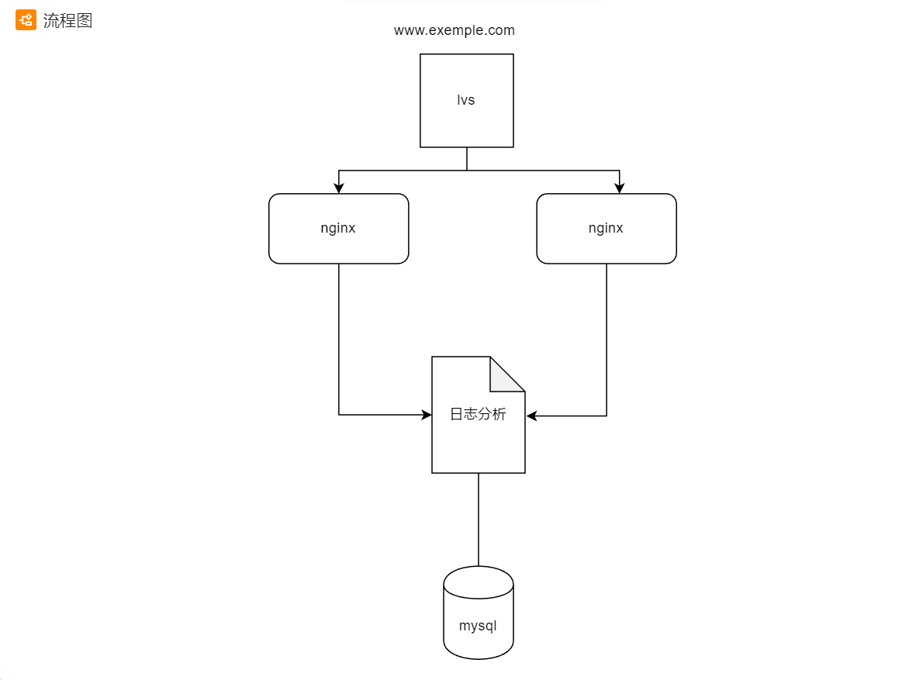

# 小米集团训练营SRE大作业

## 作业简介和功能介绍

#### 需求：

* 场景1.用户通过www.example.com的方式访问lvs服务，lvs将请求均衡转发到nginx服务，然后根据不同请求路径/静态文件，nginx返回不同html文件内容
* 场景2.通过shell或者python脚本，去分析2台nginx机器上的access 日志，把qps（每秒的请求数）和http code为200 和500+的数量按照1分钟统计出来， 都保存到mysql数据库中。

#### 功能介绍

* 搭建lvs负载均衡集群（我采用的是lvs四层负载均衡NAT模式，调度算法为轮询），用LVS接收来自客户端的请求并将请求衡转发到后端的nginx服务器中，服务器能够根据客户端的不同请求返回对应的文件内容。同时，通过运行shell脚本，对后端nginx服务器的日志进行分析，将分析结果返回到mysql数据库中，分析结果包含nginx服务器每分钟接收到的请求数，以及每分钟http code（状态码）为200和500+的数量。通过对mysql数据库中的数据进行分析，我们可以了解服务器的性能状态，根据请求数和状态码的分布，我们可以优化服务器的资源配置等。

#### 流程图

#### 组件说明

| 组件     | 描述                                                         | 部署方式              |
| -------- | ------------------------------------------------------------ | :-------------------- |
| LVS      | 作为整体服务流量入口，能够将请求转发给后端nginx，且能实现流量负载均衡 | LVS NAT 模式          |
| nginx    | 作为web中间件，接受来自lvs的流量，将nginx服务上的静态html文件返回给用户 | nginx虚拟主机         |
| 日志分析 | 通过读取nginx上的access 日志，来分析QPS，统计请求的http code 为200 和5xx的数量 | crontab执行脚本       |
| mysql    | 存放分析日志结果                                             | --------------------- |

## 实验环境：

###### 系统：

* centos7系统

###### LVS虚拟主机配置：

* 网络配置: VIP:172.30.154.100(桥接模式)

​                        DIP:192.168.222.132(NAT模式)

* 软件安装：ipvsadm工具，mysql5.7.44

###### nginx服务器虚拟主机：

* 网络配置：

​       nginx服务器主机1:IP:192.168.222.135(NAT模式)

​       nginx服务器主机2:IP:192.168.222.136(NAT模式)

* 软件安装:mysql5.7.44以及nginx

